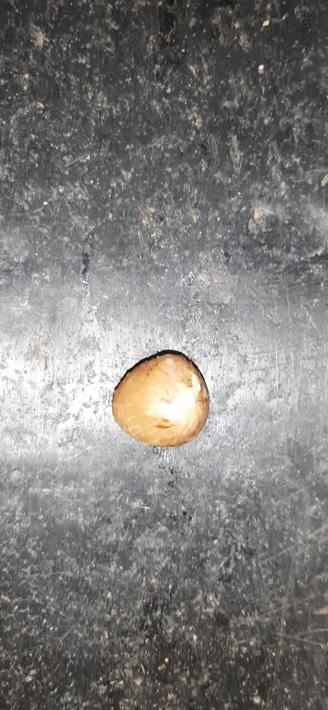
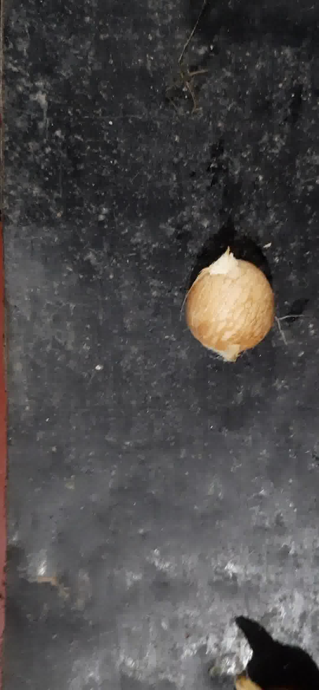

# Areca Classifier
A proof-of-concept showcasing the applicability of deep learning for classifying good and bad quality arecanuts.  


| Good Image    | Bad Image    |
| - | - |
|  | |


This project has two components Prediction Component and a Stepper Motor Controller.

## Image Reader and Prediction Component
This is my personal laptop capable of loading the Keras model, streaming the IP Camera video stream and a MQTT broker.
The entry point of this component is `runner.py`.

## Stepper Motor Controller
This is the RaspberryPi 4 that listens to the MQTT topic and controls the stepper motor.
The entry point of this component is `category_controller.py`.

## How to run the project
Follow the below steps in the exact order.

1. Run the Stepper Motor controller:
    ```bash
    python src/category_controller.py
    ```
2. Start the IP Camera
3. Run the Image Reader & Prediction component:
    ```bash
    python src/runner.py
    ```